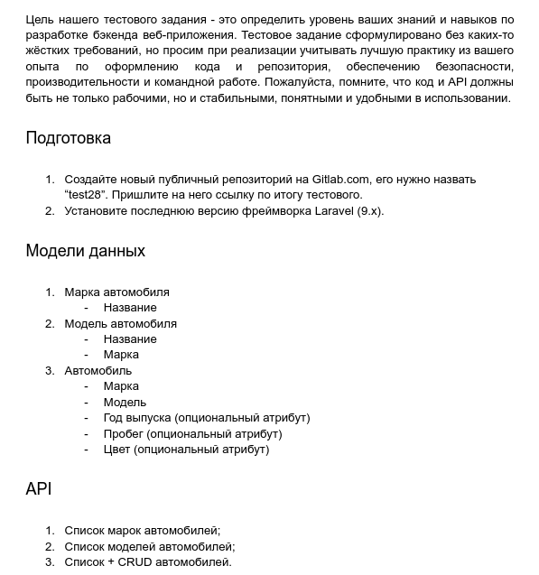
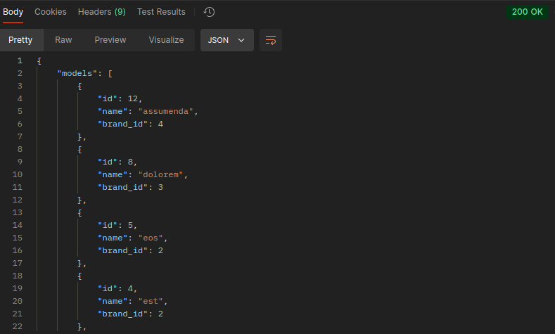
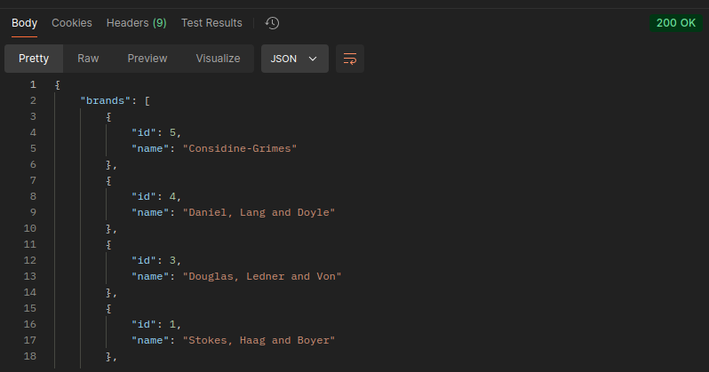
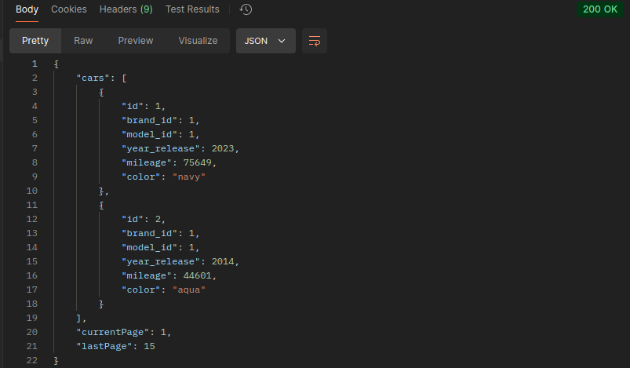
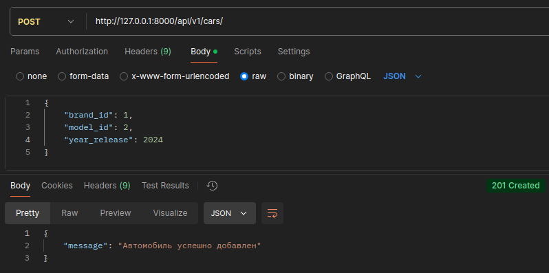
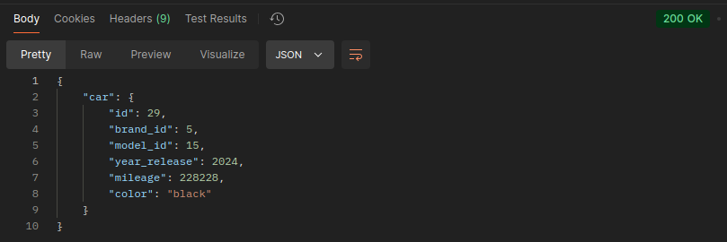
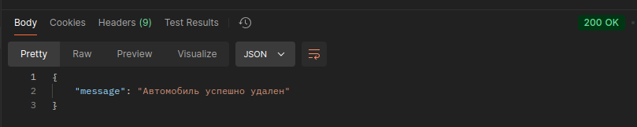

# Описание проекта

Реализация тестового задания на Laravel 10 по написанию REST API.

## Само задание

## Что использовал при написании проекта

- `Factories` и `Seeds` для заполнения таблиц тестовыми данными
- `apiResource` контроллер для CRUD-операций
- Слой преобразования `API Resource`
- `Form Request` для валидации данных
- Паттерн `Repository` для выборок данных из таблиц
- Для дальнейшего написания бизнес-логики создал сервисный слой`Service`

## Разворачивание проекта

1. Клонируем репозиторий:
   https://github.com/GenduDeveloper/test-task.loc.git
2. Создаем и настраиваем файл `.env` по примеру из файла`.env.example`
3. В корне проекта: `composer install`
4. Применяем миграции: `php artisan migrate`
5. Создаем тестовые данные в таблицах: `php artisan db:seed`

## Тестирование работы API (Postman)

1. Список всех марок (по алфавиту) автомобилей:

GET запрос, URL: http://127.0.0.1:8000/api/v1/models

2. Список всех моделей (по алфавиту) автомобилей:

GET запрос, URL: http://127.0.0.1:8000/api/v1/brands

3. Список всех автомобилей (с пагинацией):

GET запрос, URL: http://127.0.0.1:8000/api/v1/cars

4. СRUD

**Создание** автомобиля.
POST запрос, URL: http://127.0.0.1:8000/api/v1/cars

**Просмотр** определенного автомобиля.
GET запрос, URL: http://127.0.0.1:8000/api/v1/cars/{id}

**Обновление** определенного автомобиля.
PATCH запрос, URL: http://127.0.0.1:8000/api/v1/cars/{id}

**Удаление** определенного автомобиля.
DELETE запрос, URL: http://127.0.0.1:8000/api/v1/cars/{id}

